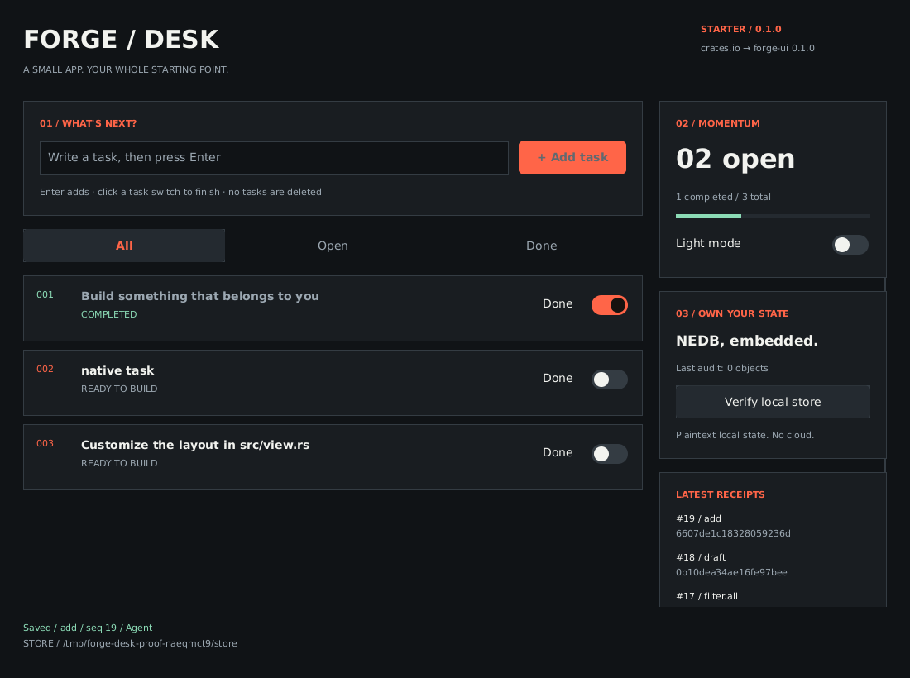

# Forge Desk

A starter desktop application built with **forge-ui 0.1.0 from crates.io**. It lives inside the Forge UI repository but has its own manifest and lockfile. There is no path dependency or patched copy of the framework.



## Run

From the Forge UI repository root:

```sh
cd examples/forge-desk
cargo run --locked --release
```

Or compile without changing directories:

```sh
cargo run --locked --release --manifest-path examples/forge-desk/Cargo.toml
```

A native **Forge Desk** window opens. The first build downloads dependencies. Use stable Rust and your platform's native toolchain: Xcode command-line tools on macOS; MSVC plus Visual Studio C++ Build Tools on Windows; on Linux, a graphical X11/Wayland session and the native libraries listed in the repository's main README.

## Test drive

1. Type a task and press Enter or click Add task. Blank tasks are rejected.
2. Flip its Done switch. The task retains its stable ID and updates the completion meter.
3. Try All, Open and Done. Filters only change the view; nothing is deleted.
4. Toggle Light mode.
5. Close and run again **from the same directory**. Tasks, draft, filter and theme return from NEDB.
6. Click Verify local store. The last-audit count updates using the real engine.

State is stored in `.forge-desk-data` relative to the working directory. Use an explicit path when launching from different places:

```sh
cargo run --locked --release -- --data ./my-desk
```

The directory must be empty or an existing Forge Desk store. An app-specific marker prevents accidentally repurposing the framework showcase's database or another nonempty directory. Do not point this at `.forge-ui-data`.

## Customize in four small files

| File | Change here |
| --- | --- |
| `src/state.rs` | Task data, validation and pure action reducer |
| `src/view.rs` | Layout, styling, controls, empty state and progress paint |
| `src/app.rs` | NEDB persistence, receipts, error handling and agent inspection |
| `src/main.rs` | Window options, command-line arguments and startup |

Add a data field in State, validate it, implement a reducer action, then expose a control in view. Keep IDs stable: `task.1`, not a title or array position. Keep I/O out of view. The pure reducer is unit-tested independently from the window and database.

This starter intentionally has no delete action. Completing a task preserves it. Every state change is a native NEDB version, with the action and source in the same object and a causal edge to its predecessor. Saves are acknowledged only after the published journal adapter flushes successfully. After a storage failure, further writes pause until reopen because a failed save may be partially applied.

## Operate it with an agent

```sh
cargo run --locked --release -- --agent
```

Wait for the `forge-ui/1` ready event. NEDB may print startup diagnostics before it. Then send JSON lines, one request/response at a time:

```json
{"request_id":"1","op":"inspect"}
{"request_id":"2","op":"set_text","id":"draft","text":"Build my first desktop app"}
{"request_id":"3","op":"click","id":"add"}
{"request_id":"4","op":"click","id":"task.1"}
{"request_id":"5","op":"click","id":"filter.done"}
{"request_id":"6","op":"click","id":"verify"}
{"request_id":"7","op":"screenshot","path":"desk-proof.ppm"}
{"request_id":"8","op":"quit"}
```

Inspect the real IDs before operating an existing store. `click` toggles the current task state, so inspect before toggling. A filtered-out task is absent from the current tree; switch to All to expose it. The full task state is also available in `result.app.state`.

Always check `result.app.error`, `result.app.storage_blocked`, resulting state and receipt—not only protocol `ok`. The protocol can accept a valid text action that the app rejects (for example a title over the 120-byte limit). There is no network listener or LLM dependency; `--agent` explicitly grants the launching process access to the UI. Source labels are adapter provenance, not authenticated human identity.

## Verify

```sh
cargo fmt --all --check
cargo clippy --locked --all-targets -- -D warnings
cargo test --locked
cargo build --locked --release
```

Linux native smoke test (requires Xvfb and libXtst):

```sh
xvfb-run -s "-screen 0 1400x1000x24" python3 tools/smoke.py target/release/forge-desk
```

The smoke test launches the real window, injects mouse and keyboard input via XTest, exercises the agent protocol, filters and invalid input, then kills and reopens the process using the same NEDB store. Temporary test stores are retained for inspection. Pillow is optional for PNG conversion only.

## Boundaries

- Maximum 200 tasks and 120 UTF-8 bytes per title. This is a starter, not an unbounded productivity service.
- All edits, including drafts, are persisted locally in **plaintext**. Do not enter secrets. No automatic history retention/cleanup.
- Whole-state snapshots and synchronous saves are appropriate for this small example, not high-frequency telemetry.
- Forge UI 0.1.0 does not provide clipboard, IME composition, complex-script shaping or an OS accessibility bridge. See the framework guide for its full limitations.
- Linux/X11 was exercised live. Native macOS/Windows interaction has not been verified for this app; CI compilation is a different claim.
- This example is covered by the repository's BUSL-1.1 license and GPLv3 change terms. Third-party dependencies retain their own licenses.
